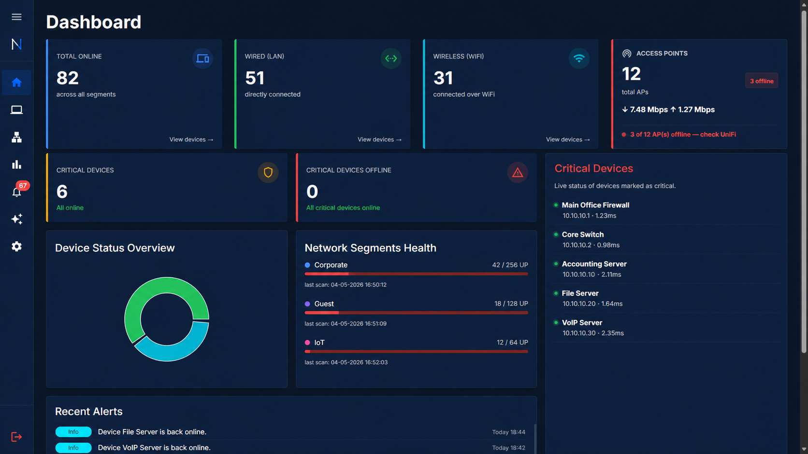
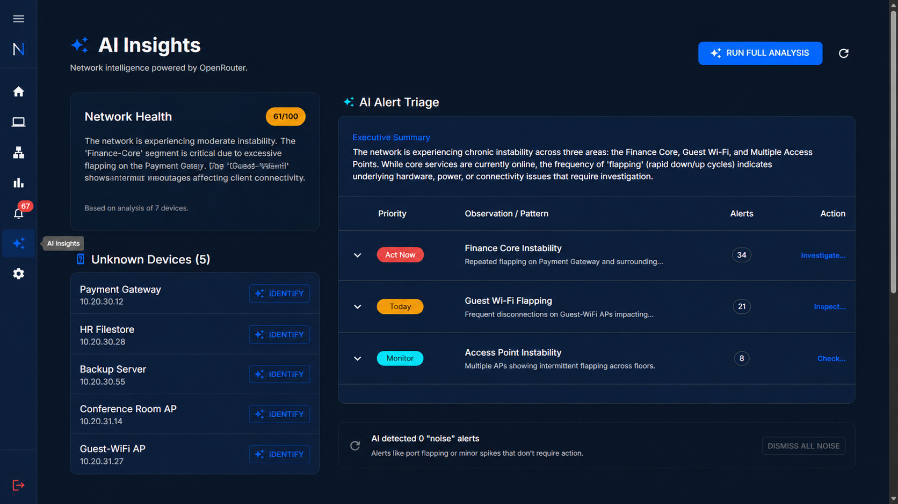

<div align="center">

# NetAIQ Dashboard

**A self-hosted AI-powered SMB network monitoring dashboard with real-time device tracking, alerting, and UniFi integration.**

[](https://nodejs.org)
[](https://reactjs.org)
[](https://fastify.dev)
[](https://docker.com)
[](LICENSE)

</div>

---

## ✨ Features

- 📡 **Split-Interval Monitoring** — Independent high-frequency polling for critical devices and periodic full-segment scans
- ⚡ **Escalating Poll Mode** — Switches to 30s polling when a critical device goes offline, capped at 20 attempts
- 📊 **Live Job Status** — Real-time countdowns and escalation status visible in the Settings UI
- 🏢 **Network Segments** — Organise devices by subnet (CIDR) with automated host discovery and strict validation
- 🔍 **MAC OUI Lookup** — 1,100+ device manufacturers identified instantly (IoT, mobile, gaming, network, servers, cameras)
- 🌐 **UniFi Integration** — Full health oversight including WAN stats, Access Point status, and throughput monitoring
- 🚨 **Bulk Device Management** — Register multiple discovered devices in a single click
- 📈 **Bandwidth Insights** — Top-talker view and per-period WAN throughput charts sourced from UniFi reports
- 📧 **Automated Alerting** — Configurable email alerts (SMTP) for device events and high latency
- 📲 **Telegram Notifications** — Real-time bot alerts for critical device offline/online, AP status changes, and segment outages
- 🤖 **Two-Way Telegram Bot** — Query live network state on demand (status snapshot, device/segment lookups, on-the-fly `/ping`, alert review) with chat-ID-whitelisted command access, multi-operator support, and per-chat rate limiting
- 🤖 **AI Insights** — Automated device identification (OUI + AI), 24h anomaly detection, and alert triage via Anthropic or OpenRouter
- 🧹 **Automated Data Maintenance** — Configurable background jobs for ping history and alert data retention
- 🔐 **Hardened Security** — Unified JWT authentication (Socket.IO + API), login rate limiting, atomic scan locking, and hidden production stack traces

---

## 📸 Screenshots

<div align="center">

### Dashboard


### AI Insights


</div>

---

## 🗂️ Tech Stack

| Layer | Technology |
|---|---|
| **Frontend** | React 18, Vite, Material UI (MUI), TanStack Query, Socket.IO Client |
| **Backend** | Node.js 20, Fastify 4, Socket.IO |
| **Database** | SQLite (`better-sqlite3`) |
| **Auth** | JWT (`@fastify/jwt`), HTTP-only cookies, rate limiting |
| **Validation** | `zod` — strict schema-based input validation |
| **Monitoring** | `ping`, `setTimeout`-based schedulers, `p-limit`, `netmask` |
| **Notifications** | Nodemailer (SMTP), Telegram Bot API |
| **AI Providers** | Anthropic (Claude 3.5), OpenRouter (Llama 3, Mistral) |
| **Deployment** | Docker, Docker Compose |

---

## 🚀 Quick Start (Docker)

### Prerequisites
- [Docker](https://docs.docker.com/get-docker/) and [Docker Compose](https://docs.docker.com/compose/install/)

### 1. Clone the repository

```bash
git clone https://github.com/yourusername/netaiq-dashboard.git
cd netaiq-dashboard
```

### 2. Create your environment file

```bash
cp .env.example .env
```

Open `.env` and set a strong `JWT_SECRET` — everything else can stay as-is for a local setup. UniFi, email, Telegram, and AI settings are configured through the Settings page after first login.

```env
PORT=3001
NODE_ENV=production
JWT_SECRET=your_strong_random_secret_here   # change this
DB_PATH=./data/netaiq.db
```

> [!TIP]
> Generate a strong secret with: `openssl rand -hex 64`

### 3. Build and run

```bash
docker compose up -d --build
```

### 4. Access the dashboard

Navigate to **[http://localhost:3001](http://localhost:3001)** (or `http://<server-LAN-IP>:3001` from another machine).

**Default credentials:**

| Field | Value |
|---|---|
| Username | `admin` *(lowercase — case-sensitive)* |
| Password | `Admin@1234` |

> [!WARNING]
> On first login you will be prompted to choose a unique username and set a new password before accessing the dashboard.

---

## 🔒 HTTPS Setup (Optional)

The default stack runs over plain HTTP, which is fine for home lab and LAN use. If you need HTTPS — for public exposure, Let's Encrypt, or to avoid browser warnings — NetAIQ includes a **Caddy overlay** that handles SSL automatically.

### Option A — LAN / local HTTPS (self-signed cert)

Add these to your `.env`:

```env
SITE_ADDRESS=192.168.1.10   # your server's LAN IP
HTTP_PORT=3080
HTTPS_PORT=3443
```

Start with the Caddy overlay:

```bash
docker compose -f docker-compose.yml -f docker-compose.caddy.yml up -d --build
```

Access at `https://192.168.1.10:3443`. Your browser will show a certificate warning because the cert is self-signed by Caddy's internal CA.

To remove the warning, install the Caddy root CA on each client machine:

<details>
<summary><strong>Linux</strong></summary>

```bash
# Extract the cert from the running Caddy container
docker compose -f docker-compose.yml -f docker-compose.caddy.yml exec caddy \
  cat /data/caddy/pki/authorities/local/root.crt > caddy-root.crt

# Trust it system-wide
sudo cp caddy-root.crt /usr/local/share/ca-certificates/caddy-root.crt
sudo update-ca-certificates

# Trust it in Chrome / Chromium (requires libnss3-tools)
certutil -d sql:$HOME/.pki/nssdb -A -t "CT,," -n "Caddy Local CA" -i caddy-root.crt
```

Restart Chrome completely after importing.
</details>

<details>
<summary><strong>Windows</strong></summary>

```bash
# On the Linux host — extract the cert
docker compose -f docker-compose.yml -f docker-compose.caddy.yml exec caddy \
  cat /data/caddy/pki/authorities/local/root.crt > caddy-root.crt
```

Copy `caddy-root.crt` to the Windows machine, rename it to `caddy-root.cer`, then either:

- Double-click → **Install Certificate** → **Local Machine** → **Trusted Root Certification Authorities**

Or via PowerShell (Admin):

```powershell
Import-Certificate -FilePath "C:\path\to\caddy-root.cer" -CertStoreLocation Cert:\LocalMachine\Root
```

Chrome and Edge pick this up immediately. Firefox users must also import via **Settings → Privacy & Security → View Certificates → Authorities → Import**.
</details>

<details>
<summary><strong>macOS</strong></summary>

```bash
# On the Linux host — extract the cert
docker compose -f docker-compose.yml -f docker-compose.caddy.yml exec caddy \
  cat /data/caddy/pki/authorities/local/root.crt > caddy-root.crt
```

Copy `caddy-root.crt` to the Mac, then:

```bash
sudo security add-trusted-cert -d -r trustRoot -k /Library/Keychains/System.keychain caddy-root.crt
```

Or double-click the file → open in Keychain Access → set **Trust → When using this certificate** to **Always Trust**.
</details>

---

### Option B — Public domain with Let's Encrypt (trusted cert, no warnings)

Let's Encrypt issues a free, browser-trusted cert for any public domain. Caddy handles renewal automatically.

**Requirements:**
- A domain with an A/AAAA record pointing to your server
- Port **80** reachable from the public internet (for the ACME HTTP-01 challenge)

Add these to your `.env`:

```env
SITE_ADDRESS=netaiq.example.com   # your domain
HTTP_PORT=80
HTTPS_PORT=443
```

Start the stack:

```bash
docker compose -f docker-compose.yml -f docker-compose.caddy.yml up -d --build
```

Access at `https://netaiq.example.com` — no certificate warnings, no client-side setup.

> [!IMPORTANT]
> Make sure your domain's DNS record is live and port 80 is open **before** starting the stack. Let's Encrypt rate-limits failed issuance attempts.

---

### Option C — Bring your own reverse proxy

If you already run Nginx, Traefik, or another proxy, skip Caddy entirely. Use just the base compose file and expose the app port:

```bash
docker compose up -d --build
```

Proxy HTTPS traffic to `http://<server-ip>:3001`. Add one extra env var so auth cookies are marked secure over HTTPS:

```env
COOKIE_SECURE=true
```

The app is configured with `trustProxy: true`, so it will correctly read `X-Forwarded-For` and `X-Forwarded-Proto` headers from your proxy.

> [!NOTE]
> Do not set `COOKIE_SECURE=true` for plain HTTP deployments — browsers will silently drop secure cookies on HTTP connections and logins will fail.

---

## ⚙️ Configuration

All settings are managed from the **Settings** page in the UI after logging in.

| Setting | Description |
|---|---|
| **UniFi Controller** | URL and credentials for UniFi integration |
| **SMTP / Email** | Mail server and recipient settings for alerts |
| **Telegram** | Bot token and chat ID(s) — single ID for one operator, or comma-separated for multi-operator inbound commands |
| **Critical Ping Interval** | How often to ping critical devices (default: 120s) |
| **Segment Scan Interval** | How often to sweep all subnets (default: 15 min) |
| **UniFi Sync Interval** | How often to pull data from UniFi (default: 5 min) |
| **Alert Cooldown** | Minimum time between duplicate alerts per device (default: 15 min) |
| **Ping History Retention** | Days to retain latency history (default: 90 days) |
| **Alert History Retention** | Days to retain alert history (default: 180 days) |

> [!NOTE]
> Cleanup jobs run automatically in the background. Unresolved critical alerts are never deleted by retention policies.

---

## 📲 Telegram Notifications

### 1. Create a Telegram Bot
1. Open Telegram and message **@BotFather**.
2. Send `/newbot` and follow the prompts.
3. Copy the **Bot Token** (e.g., `123456789:ABCdefGHIjklMNOpqrSTUvwxyz`).

### 2. Get Your Chat ID
1. Send `/start` to your new bot.
2. Visit `https://api.telegram.org/bot<YOUR_TOKEN>/getUpdates` in a browser.
3. Find `chat_id` in the JSON response. Group chat IDs are negative numbers.

> [!TIP]
> To authorise multiple operators for inbound bot commands, enter chat IDs as a
> comma-separated list (e.g. `111111111,222222222,-100333333333`). Each entry is
> validated independently; outbound alert notifications still go to the first
> ID only.

### 3. Configure in NetAIQ
1. Navigate to **Settings > Telegram**.
2. Toggle **Enable Telegram Notifications** on.
3. Paste your **Bot Token** and **Chat ID**.
4. Click **Test Notification** to verify.
5. Under **Alert Event Selection**, choose which event types trigger a notification. All events are enabled by default — uncheck any you want to suppress.
6. Optionally enable **AI-Enhanced Alerts** to append AI-generated remediation steps to each notification. Requires a valid API key in AI Settings.
7. Optionally enable **Bot Commands (two-way)** to query live network state from the chat (see [Two-Way Bot Commands](#-two-way-bot-commands) below).
8. Click **Save Settings**.

### 4. Supported Events

Each event type is individually toggleable. All are enabled by default.

| Category | Event | Trigger | Severity |
|---|---|---|---|
| **Device** | Critical Device Offline | A critical device fails ping checks | 🔴 Critical |
| **Device** | Critical Device Restored | A critical device comes back online | 🟢 Recovery |
| **Access Point** | Access Point Offline | A UniFi AP goes offline | 🔴 Critical |
| **Access Point** | Access Point Restored | A UniFi AP comes back online | 🟢 Recovery |
| **Segment** | Segment Unreachable | A segment scan returns 0 devices | 🔴 Critical |

> [!NOTE]
> Alerts fire only on **status changes**, not every scan cycle. Telegram failures are non-blocking and will never delay or crash the monitoring system.

---

## 🤖 Two-Way Bot Commands

Beyond pushing alerts, the bot can answer **on-demand queries** about live network
state. This is opt-in and independent of the outbound alert toggles.

### Enable

1. Navigate to **Settings > Telegram** and configure the **Bot Token** and **Chat ID** as above.
2. Toggle **Enable Bot Commands (two-way)** on and click **Save Settings**.
   Polling starts immediately — no server restart needed.

### How it works

- Uses **long polling** (Telegram `getUpdates` with a 25s server-side wait), so
  it works on self-hosted deployments with **no public URL, no inbound port, and
  no webhook**.
- **Security**: only messages from chat IDs in the configured allow-list are
  processed. Unauthorised chats are silently ignored — the bot never replies,
  so an attacker DMing the bot cannot consume your `sendMessage` rate budget.
  Forensic warnings are logged server-side.
- **Multi-operator**: the chat-ID field accepts a comma-separated allow-list, so
  several operators can share a single bot. Each operator is rate-limited
  independently.
- **Rate limit**: 20 commands per minute per chat ID. Excess invocations get a
  `⏳ Too many commands — try again in Ns.` reply.
- **Discoverability**: on startup the bot registers its command list with
  Telegram (`setMyCommands`), so typing `/` in your chat shows native
  autocomplete with all commands and one-line descriptions.
- **Threading**: each reply is sent as a Telegram quote-reply to the original
  command message, keeping context obvious in a busy chat. Long responses are
  automatically chunked across multiple messages to stay within Telegram's
  4096-character limit.
- **State**: all replies are read-only snapshots queried directly from the local
  database; commands never trigger new scans. The exceptions are `/aps` (live
  UniFi read) and `/ping` (one-shot ICMP probe of the requested target).
- **Resilience**: the polling loop is fully non-blocking and crash-safe. On
  process restart the bot discards any messages queued during downtime so old
  commands aren't replayed. Transient API errors back off and retry; a `409`
  conflict (another consumer polling the same token) stops the loop cleanly
  with an actionable log line.

### Commands

#### 📊 Status

| Command | Description |
|---|---|
| `/status` | Network snapshot (devices, alerts, AP summary, next poll/scan) |
| `/online` | Devices currently up, fastest first |
| `/offline` | Devices currently down, longest-offline first |
| `/critical` | Critical-flagged devices + any active escalating polls |
| `/aps` | UniFi access point health (degrades gracefully if UniFi is unconfigured) |
| `/segments` | Configured segments with device counts and last-scan freshness |
| `/alerts` | Last 10 unread alerts |
| `/alerts_all` | Last 20 alerts regardless of read state (`/alerts all` also works) |

#### 🔍 Lookups

| Command | Description |
|---|---|
| `/device <name\|ip>` | Detail card for a single device (status, segment, MAC, vendor, last seen) |
| `/segment <name>` | Detail card for a single segment (CIDR, device counts, last scan) |
| `/ping <ip\|hostname>` | One-shot ICMP probe; target is validated against `[A-Za-z0-9._-]{1,253}` |

#### ⚡ Actions

| Command | Description |
|---|---|
| `/markread` | Mark all unread alerts as read |

#### ℹ️ Info

| Command | Description |
|---|---|
| `/version` | Bot version, Node version, and process uptime |
| `/help` | Full command reference |

> [!NOTE]
> Commands work even when outbound Telegram alerts are disabled — the polling
> loop is gated only by the bot token, chat ID, and the **Bot Commands** toggle.

---

## 🔍 Scanning Architecture

NetAIQ uses a split-polling strategy to balance low-latency monitoring for critical infrastructure with broad visibility across multiple subnets.

### Critical Device Polling
- **Scope**: Devices tagged as "Critical" in the UI
- **Interval**: Configurable (default: 120s)
- **Behavior**: Runs independently of segment scans

### Segment Scanning
- **Scope**: Every IP within registered CIDR segments
- **Exclusion**: Critical devices are skipped to prevent redundant pings
- **Staggering**: Pauses if a Critical Poll is running to prioritise resources

### Escalating Poll Mode
- **Trigger**: Activates when a Critical device transitions from Online to Offline
- **Frequency**: 30-second polls on the affected device(s)
- **Cap**: Stops after 20 attempts (~10 minutes), then reverts to the standard Critical interval
- **Visibility**: Active escalations show real-time attempt counts in **Settings > Polling Intervals**

---

## 🤖 AI Insights

### Requirements
An API key from [Anthropic](https://console.anthropic.com/) or [OpenRouter](https://openrouter.ai/).

### Setup
1. Navigate to **Settings > AI Settings**.
2. Toggle **Enable AI Insights** on.
3. Select your **Provider** (Anthropic or OpenRouter).
4. Enter your **API Key** and click **Test Connection**.
5. Select a **Model** from the dropdown (e.g., `Claude 3.5 Sonnet`).

### Features
- **Device Identification**: OUI lookup covers 1,100+ manufacturers. Use "Auto-Identify" for AI-powered suggestions on unrecognised devices.
- **Anomaly Detection**: Analyses the last 24h of ping logs every 10 minutes for latency patterns.
- **Alert Triage**: Groups recent alerts into logical patterns with recommended actions. Token-efficient — skips analysis when no new alerts have occurred.

### Device Discovery
NetAIQ uses a dual-source discovery system:

- **UniFi Harvest**: Pulls active WiFi/Wired clients and up to 4 weeks of historical device data from your UniFi Controller.
- **ARP Scanning**: An L2-segment-aware `nmap` ARP scanner. Auto-detects the server's LAN segment and scans for wired devices using raw sockets, with fallbacks to `ip neigh` and `arp -a`.

> [!NOTE]
> ARP scanning on Linux/Docker requires `NET_RAW` and `NET_ADMIN` capabilities (set in `docker-compose.yml`). On Mac/Windows Docker Desktop, ARP scanning is unavailable due to virtualisation networking limits — discovery falls back to UniFi Harvest only.

### MAC Tracking
- MACs are normalised to lowercase colon-separated format
- Duplicates are detected and updated rather than re-inserted
- IP address changes are logged while maintaining the same device record
- Multicast/broadcast MACs are automatically filtered

> [!IMPORTANT]
> AI identification is rate-limited to 3 calls per device per minute.

---

## 🧑‍💻 Local Development

```bash
# Install all dependencies
npm install
cd client && npm install && cd ..

# Run frontend (Vite :5173) and backend (:3001) concurrently
npm run dev
```

The Vite dev server proxies `/api` and `/socket.io` to `http://localhost:3001`,
so you can hit the UI at `http://localhost:5173` while the backend runs on
3001. Make sure your `.env` exists (copy from `.env.example`) before starting.

---

## 📚 Further Documentation

For deeper operational details — backup/restore, upgrade paths, log locations,
common failure modes, security hardening, and the full REST API reference —
see [DEPLOYMENT.md](DEPLOYMENT.md) and [API.md](API.md).

---

## 📁 Project Structure

```
netaiq-dashboard/
├── client/                  # React frontend (Vite)
│   └── src/
│       ├── components/      # Reusable UI components
│       ├── hooks/           # useAuth, useSocket, useInfiniteDevices
│       └── pages/           # Dashboard, Devices, Segments, Bandwidth,
│                            # Alerts, Insights, Settings, Login, ChangePassword
├── server/                  # Fastify backend
│   ├── db/                  # SQLite schema, migrations, seed
│   ├── jobs/                # Background jobs (ping, UniFi sync, AI, cleanup)
│   ├── routes/              # API route handlers
│   ├── services/            # Business logic (ping, UniFi, scan, alert, AI, Telegram)
│   ├── scripts/             # Maintenance scripts (e.g. update-oui-db)
│   └── public/              # Built frontend assets (output of `npm run build`)
├── assets/                  # README screenshots
├── data/                    # SQLite database (auto-created, persisted via volume)
├── Caddyfile                # Reverse-proxy config used by the HTTPS overlay
├── Dockerfile
├── docker-compose.yml       # Default HTTP stack
├── docker-compose.caddy.yml # Optional HTTPS overlay
├── API.md                   # REST API quick reference
├── DEPLOYMENT.md            # Deep-dive deployment, ops & troubleshooting guide
└── .env.example
```

---

## 📄 License

This project is licensed under the [MIT License](LICENSE).

---

## ☕ Support the Project

NetAIQ is free and open-source. If it saves you time or helps keep your network reliable, consider buying me a coffee — it goes directly toward continued development, bug fixes, and new features.

| Platform | Link |
|---|---|
| **Ko-fi** | [ko-fi.com/xela_labs](https://ko-fi.com/xela_labs) |
| **PayPal** | [paypal.me/WebDevByElectric](https://paypal.me/WebDevByElectric) |

No pressure — a GitHub star or sharing the project is just as appreciated. 🙏

---

<div align="center">

Made with ❤️ for small and medium business network administrators

</div>
